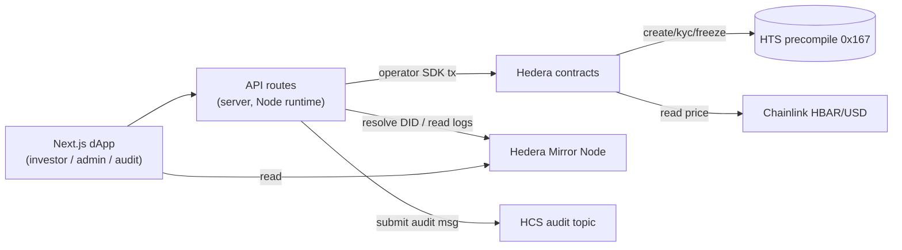
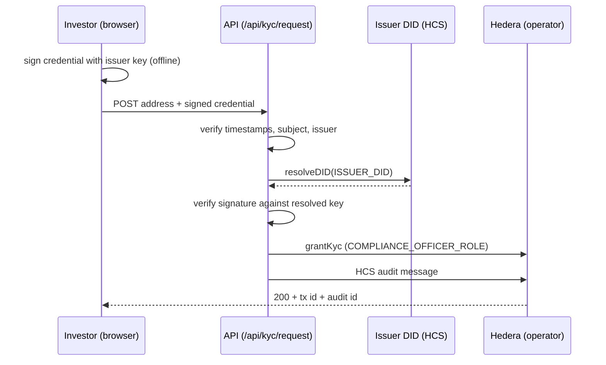

# Scaffold-HBAR — Compliance Token

An HTS **compliance token** on Hedera: KYC / freeze / pause / supply controls enforced
by a Solidity contract, sold for HBAR at a Chainlink USD price with a per-investor cap,
and administered through a Next.js dApp backed by a compliance API that verifies signed
investor credentials against a `did:hedera` issuer.

Create a project from this template:

```bash
npm create scaffold-hbar@latest -- --template <owner>/<this-repo>
```

## What this template demonstrates

- **HTS compliance controls** — `ComplianceToken` creates an HTS fungible token whose
  KYC, freeze, supply, pause and admin keys are `contractId` keys bound to the contract
  itself, then exposes role-gated `grantKyc` / `revokeKyc` / `freeze` / `unfreeze` /
  `pause` / `unpause` and a `saleTransfer` treasury hook.
- **HIP-358 token creation** — creation fee paid from `msg.value` in tinybar with the
  20% premium buffer.
- **Oracle-priced sale** — `TokenSale` reads a Chainlink HBAR/USD aggregator through a
  swappable `ChainlinkPriceFeedAdapter`, checks round freshness and enforces a
  per-investor USD cap.
- **Verifiable credentials** — `did:hedera` issuer, Ed25519-signed credentials, and
  on-chain DID resolution (with a documented reduced-mode fallback).
- **HCS audit trail** — every compliance action is submitted to a Hedera Consensus
  Service topic, with a Mirror-Node-backed timeline in the UI.
- **Developer experience tooling** — `yarn doctor` / `yarn setup` / `yarn deploy:testnet`
  / `yarn proof` for secret-safe, resumable setup and deployment.
- **Agent skills** — task-focused guidance for coding agents in `.agents/skills/` (see
  [`AGENTS.md`](AGENTS.md)).

See [`packages/hardhat/docs/architecture.md`](packages/hardhat/docs/architecture.md) for
the treasury/key design and unit handling.

## Prerequisites

- [Node.js](https://nodejs.org/) ≥ 20.18.3
- [Yarn](https://yarnpkg.com/) via Corepack: `corepack enable && corepack prepare yarn@3.2.3 --activate`
- A funded Hedera testnet account for live deploys ([faucet](https://portal.hedera.com/faucet))

> **Testnet keys only.** This template is for testnet demos. The operator and issuer
> private keys sit on the server so a single process can sign and verify; production
> would use a signing service or an HSM/KMS and never store these keys in a file.

## Starting from zero

### Prerequisites at a glance

| What | Why | How to get it |
| --- | --- | --- |
| Git | clone / scaffold the repo | <https://git-scm.com/downloads> |
| Node.js ≥ 20.18.3 | runs Hardhat and Next.js | via nvm or fnm (below) |
| Yarn 3 | package manager pinned by `packageManager` | `corepack enable` (Corepack ships with Node) |
| npm | alternative runner; ships with Node | comes with Node |
| Hedera testnet account(s) | deployer + operator (and the issuer is generated) | Hedera Portal (below) |
| WalletConnect (Reown) project ID | wallet pairing for the frontend | <https://cloud.reown.com> |

**Not needed:** a global Hardhat install — Hardhat is a **local dependency** installed by
`yarn install`. **Foundry and Docker are not needed** either.

`yarn doctor` checks all of the above and prints `[ OK ] / [MISSING] / [INVALID] / [UNSAFE]`
under a **Prerequisites** group before the secrets checks (no values are ever printed).

### Install (macOS, Linux, Windows/WSL2)

Run these on macOS, Linux, or inside WSL2 (Ubuntu):

```bash
# Git (pick one)
#   macOS:         xcode-select --install
#   Debian/Ubuntu: sudo apt update && sudo apt install -y git
#   Fedora:        sudo dnf install -y git
git --version            # expect: git version 2.x

# Node 20 via nvm (install nvm first: https://github.com/nvm-sh/nvm#installing-and-updating)
nvm install 20
nvm use 20
# or fnm: fnm install 20 && fnm use 20

# Yarn 3 through Corepack (already bundled with Node — do NOT npm i -g yarn)
corepack enable

# Verify
node -v                  # expect: v20.x or newer (e.g. v22.x)
yarn -v                  # expect: 3.2.3  (NOT 1.x)
```

**Windows:** use WSL2 and follow the Linux steps inside Ubuntu — native Windows is not
tested.

```powershell
wsl --install -d Ubuntu      # then run the Linux commands above inside Ubuntu
```

### Get your first testnet account

1. Sign in at the Hedera Portal: <https://portal.hedera.com/register>.
2. Create **testnet** accounts — one for the **deployer**, one for the **operator**.
   The Portal shows each account ID (`0.0.x`) and its key.
3. Choose the key type per role:
   - **Deployer → ECDSA** (`0x` + 64 hex). Used by Hardhat to sign EVM transactions.
   - **Operator → Ed25519** (DER or raw hex). Used by the Hedera SDK for compliance
     transactions.
4. On the Portal, copy each key in the format for its role (deployer: the ECDSA hex;
   operator: the Ed25519 DER/hex). `yarn setup` accepts and normalises either form.
5. Fund the accounts from the faucet: <https://portal.hedera.com/faucet>
   (deployer ≥ ~100 HBAR recommended, operator ≥ ~20 HBAR).

> **Enter keys only through `yarn setup`** (hidden prompts, mode-`0600` files, validated
> against the Mirror Node). Never paste a key into chat, an issue, or any other file.

### Get a WalletConnect project ID

The frontend pairs wallets through WalletConnect (Reown). Create a free project at
<https://cloud.reown.com>, then put its ID in `NEXT_PUBLIC_WALLET_CONNECT_PROJECT_ID` in
`packages/nextjs/.env.local`. Without it the app falls back to a shared demo ID (fine for
local viewing only).

Wallets the scaffold frontend actually configures
(`packages/nextjs/services/web3/wagmiConnectors.tsx`): **MetaMask** and
**WalletConnect** (any WalletConnect-compatible wallet), plus a **development burner
wallet** shown only on local networks.

### First commands

```bash
npm create scaffold-hbar@latest -- --template <owner>/<this-repo>
cd <this-repo>
yarn install
yarn doctor          # fresh machine: NOT READY — follow the "next:" lines
yarn setup           # enter keys through hidden prompts
yarn deploy:testnet  # contracts, token, roles, audit topic, issuer DID
yarn dev             # http://localhost:3000
```

`yarn doctor` is expected to be **NOT READY** before `yarn setup` and `yarn deploy:testnet`
have run — it prints the exact next command for each item.

### Common first-run problems

| Symptom | Cause | Fix |
| --- | --- | --- |
| `node -v` shows < 20.18.3 or "Unsupported engine" | Node not switched | `nvm install 20 && nvm use 20` |
| `yarn: command not found` or `yarn -v` shows `1.x` | Corepack not enabled | `corepack enable` |
| `error This project's package.json defines "packageManager"` / lockfile errors | ran `npm install` against the Yarn lockfile | `rm -rf node_modules && yarn install` |
| doctor: `Reachable: … [ WARN ]` | network / firewall / VPN / proxy | allow `testnet.hashio.io` and `testnet.mirrornode.hedera.com` |
| `deploy:testnet` fails with insufficient funds | faucet not used | fund the deployer/operator from the faucet, re-run `yarn doctor` |
| `yarn doctor` says `[UNSAFE]` | a secret is in a tracked/`NEXT_PUBLIC_` file | move it to `packages/hardhat/.env` / `packages/nextjs/.env.local` |

## Quick start

### From a fresh clone / scaffold

```bash
git clone <this-repo> && cd <this-repo>   # or the npm create … command above
yarn install
yarn setup          # interactive: fills only what is missing, hidden prompts, 0600 files
yarn doctor         # read-only checklist; must print READY
yarn deploy:testnet # resumable: contracts, token, roles, audit topic, issuer DID
yarn dev            # http://localhost:3000
```

`yarn setup` never asks you to paste a key into chat and never echoes a secret; it
accepts hex or DER, normalises it, writes to git-ignored files with mode `0600`, and
validates against the Mirror Node.

### Running without any secret

The app is designed to boot with no env files at all:

```bash
yarn install
yarn dev            # pages render an explicit "Missing configuration" state
```

`yarn doctor` reports every missing item with the exact next command to run. Nothing is
mocked silently — the UI states what is unconfigured.

### Local development (no testnet)

```bash
yarn hardhat:chain                            # terminal 1: Hedera-forked node
yarn hardhat:deploy --network localhost       # terminal 2: deploy + create token
yarn dev                                      # terminal 3: frontend
```

## Keys and environment

Everything is read from `env`; keys are **never** passed on the command line. Both env
files are git-ignored. `yarn doctor` validates all of them without printing a value.

**`packages/hardhat/.env`** — contract-side (copy from `.env.example`):

| Variable | Type / format | What it does | Created / validated by |
| --- | --- | --- | --- |
| `DEPLOYER_PRIVATE_KEY` | `0x` + 64 hex (ECDSA) | Signs deploys on testnet; acceptable on testnet only | `yarn setup` / `yarn doctor` |
| `DEPLOYER_PRIVATE_KEY_ENCRYPTED` | Web3 keystore JSON | Encrypted alternative to the plain key (recommended) | `yarn hardhat:account:generate` or `yarn setup` |
| `INVESTOR_PRIVATE_KEY` | `0x` + 64 hex | Throwaway buyer used by `yarn proof` | `yarn setup` (optional) / `yarn proof` |
| `OFFICER_PRIVATE_KEY` | `0x` + 64 hex | Optional override for the acting compliance officer in the proof | manual |
| `HEDERA_RPC_URL` | URL | Hedera JSON-RPC endpoint (testnet default) | manual |

**`packages/nextjs/.env.local`** — frontend + API server (copy from `.env.example`):

| Variable | Type / format | What it does | Created / validated by |
| --- | --- | --- | --- |
| `HEDERA_NETWORK` | `testnet` \| `mainnet` | Selects network, chain id, mirror and HashScan base | `yarn deploy:testnet` |
| `HEDERA_OPERATOR_ID` | `0.0.x` | Operator account that signs compliance transactions | `yarn setup` / `yarn doctor` |
| `HEDERA_OPERATOR_PRIVATE_KEY` | Ed25519 raw hex or DER | Operator key; derived public key is compared to the Mirror Node | `yarn setup` / `yarn doctor` |
| `ISSUER_DID` | `did:hedera:testnet:<key>_<topic>` | Issuer DID resolved from HCS to verify credentials (live mode) | `yarn deploy:testnet` / `issuer:register` |
| `ISSUER_DID_PRIVATE_KEY` | Ed25519 raw hex or DER | Signs investor credentials (`credential:issue`, `issuer:register`) | `yarn setup` / `yarn doctor` |
| `ISSUER_PUBLIC_KEY` | base58 or multibase `z…` | Reduced-mode fallback: verify against this key instead of resolving the DID | `yarn setup` (fallback only) / `yarn doctor` |
| `AUDIT_TOPIC_ID` | `0.0.x` | HCS topic for the audit log | `yarn deploy:testnet` / `audit:create-topic` / `yarn doctor` |
| `COMPLIANCE_TOKEN_ADDRESS` | `0x` + 40 hex | `ComplianceToken` address (fallback when absent from `deployedContracts.ts`) | `yarn deploy:testnet` / `yarn doctor` |
| `TOKEN_SALE_ADDRESS` | `0x` + 40 hex | `TokenSale` address | `yarn deploy:testnet` / `yarn doctor` |
| `ADMIN_API_TOKEN` | ≥ 32 chars | Demo-grade Bearer token for `/api/admin/*` | `yarn setup` / `yarn doctor` |
| `NEXT_PUBLIC_*` | public | WalletConnect id and RPC overrides (never a secret) | manual |

> **DID modes.** With `ISSUER_DID` set the server resolves the DID on-chain and verifies
> against the DID document's `#did-root-key` (**live**). With only `ISSUER_PUBLIC_KEY` set
> it verifies against that key (**reduced**, an explicit fallback when registration is
> unavailable). `yarn doctor` prints which mode is active; resolution is never faked.

> **Secret hygiene.** The deployer key must never appear under `packages/nextjs/`, and no
> secret may carry a `NEXT_PUBLIC_` prefix — `yarn doctor` fails both as UNSAFE.

## Architecture



The credential-to-KYC flow:



## Contracts and response codes

| Contract | Role |
| --- | --- |
| `ComplianceToken` | Creates the HTS token, owns its compliance keys and the treasury, role-gated KYC/freeze/pause. |
| `TokenSale` | Chainlink-priced HBAR sale with a per-investor USD cap and staleness checks. |
| `ChainlinkPriceFeedAdapter` | Swappable `IPriceFeed` over a Chainlink `AggregatorV3` proxy. |
| `MockHTS` / `MockChainlinkAggregator` | Local stand-ins for `0x167` and a price feed. |

`TokenSale.buy` lets HTS decide and maps the response code to a typed error:

| Code | Error | Meaning |
| --- | --- | --- |
| 22 | — | success |
| 184 | `NotAssociated` | account not associated with the token |
| 176 | `KycNotGranted` | account has no KYC |
| 165 | `Frozen` | account is frozen |
| 265 | `Paused` | token is paused |
| 15 | `TransferFailed` | invalid / nonexistent token |

Roles: `DEFAULT_ADMIN_ROLE` (roles + creation fee), `COMPLIANCE_OFFICER_ROLE`
(compliance actions), `SALE_OPERATOR_ROLE` (`saleTransfer`, granted to `TokenSale`).

## API reference

| Route | Method | Purpose |
| --- | --- | --- |
| `/api/kyc/request` | POST | Verify a signed credential, grant KYC, log to HCS. |
| `/api/admin/[action]` | POST | `revoke-kyc`, `freeze`, `unfreeze`, `pause`, `unpause`; Bearer-guarded. |
| `/api/audit` | GET | Paginated HCS messages from the Mirror Node. |
| `/api/config` | GET | Public configuration + which env vars are missing. |
| `/api/token` | GET | Token metadata. |
| `/api/investor/status` | GET | Association / KYC / freeze / cap state. |
| `/api/hedera/account` | GET | Account lookup helper. |

Pages: `/investor` (associate → submit credential → buy), `/admin` (guarded actions),
`/audit` (HCS timeline).

Helper scripts (run from `packages/nextjs`):

```bash
yarn workspace @sh/nextjs issuer:register                      # register the issuer did:hedera
yarn workspace @sh/nextjs audit:create-topic                    # create the HCS audit topic
yarn workspace @sh/nextjs credential:issue --address 0x...      # sign a demo credential
```

## Testing and where MockHTS differs

```bash
yarn lint
yarn hardhat:test        # contract tests + dx helper unit tests (offline)
yarn next:test           # vitest: credential, DID, codes, audit, auth (resolver mocked)
yarn next:build
```

`MockHTS` reproduces the shape of the `0x167` precompile — it stores keys, only lets the
keyed contract mutate compliance state, tracks association/KYC/frozen/balance, and
**returns response codes instead of reverting** (`transferToken` checks paused → frozen →
KYC → association). It is not bytecode-compatible; the `htsAddress` is injected so tests
pass the mock address. `yarn hardhat:test:forking` runs the same suite against a forked
Hedera testnet for real precompile behaviour.

## Testnet proof

The live proof is regenerated with `yarn proof` and written to
[`packages/hardhat/docs/testnet-proof.md`](packages/hardhat/docs/testnet-proof.md). It
covers the HTS response codes, treasury/keys, the oracle, the API layer, the negative
credential cases and the DID resolution.

Highlights from the recorded run (testnet):

- ComplianceToken `0x83cA87f6D85e46836338b4fEBeC3518c3a2Cb8DA` ·
  TokenSale `0xF964dCA4F31C0c09F4adC88DbFC0aaf54ab9592c`
- Audit topic [`0.0.10791318`](https://hashscan.io/testnet/topic/0.0.10791318)
- Issuer DID `did:hedera:testnet:8itErCqgyMUu7DrE17rQh5xQoufYWM7uNpgmVtJrLW6_0.0.10791688`
  (topic [`0.0.10791688`](https://hashscan.io/testnet/topic/0.0.10791688))

## Known limits

- **USD cap applies to primary sales only.** `usdSpent` tracks purchases through
  `TokenSale`; secondary transfers are not capped.
- **Chainlink staleness.** `TokenSale.maxStaleness` (default 86400s) is deliberately long
  because we publish immediately with no fallback — tune it to the feed heartbeat.
- **Pyth is stale and now requires a Hermes API key** (since 2026-08-26), so it is not a
  drop-in fallback without an off-chain publisher.
- **Supra is fresh but USDT-quoted**, which needs an extra HBAR/USDT hop.
- **Strict `contractId` keys.** The keyed contract must be the caller; there is no
  proxy/`msg.sender` forwarding, which constrains where keys can live.
- **SaucerSwap integration is unknown for a KYC/freeze token** — its pools may not handle
  a token whose transfers can be frozen or paused.
- **Demo-grade admin guard.** `ADMIN_API_TOKEN` is a single shared secret, not real auth.
- **The real DID mode** is live `did:hedera` resolution; reduced mode exists only as an
  explicit, clearly-labelled fallback.

## Developer commands

| Command | What it does |
| --- | --- |
| `yarn doctor` | Read-only checklist (`--json`, `--strict`); exits 0 only when READY. |
| `yarn setup` | Interactive, idempotent, secret-safe credential setup. |
| `yarn deploy:testnet` | Resumable deploy (contracts, token, roles, topic, issuer DID). |
| `yarn proof` | Runs the live proof and writes `docs/testnet-proof.md`. |
| `yarn dev` | Start the Next.js app. |

## Troubleshooting

See the [`troubleshooting` skill](.agents/skills/troubleshooting/SKILL.md) for the real
failures hit while building this template (the DID-SDK `NodeClient` deep import, DER vs
raw key formats, the registrar hang, missing-configuration boot, `StalePrice`, and HTS
codes 184/176/165/265). In short: run `yarn doctor` first and follow the `next:` line.

Common cases:

- **`yarn doctor` NOT READY on a fresh clone** — expected; run `yarn setup` then
  `yarn deploy:testnet`.
- **App shows "Missing configuration"** — no env files; run `yarn setup`/`yarn doctor`.
- **Buys revert `StalePrice`** — the oracle answer is older than `maxStaleness`.
- **DID verification fails** — check `yarn doctor` issuer mode; re-register with
  `yarn deploy:testnet`.

## Project layout

- `packages/hardhat` — Hardhat config, contracts, `deploy/` scripts, tests, `docs/`,
  DX scripts under `scripts/dx/`.
- `packages/nextjs` — Next.js app (RainbowKit, wagmi), API routes, services, scripts.
- `.agents/skills` — agent skills (mirrored into `.claude/skills`).

## License

[MIT](LICENSE)
